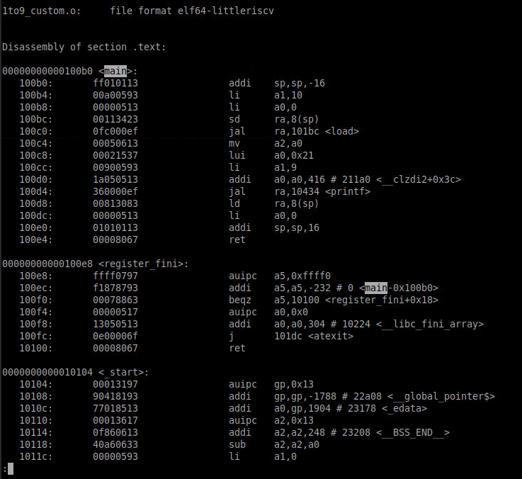

# Day 2 Content

| File | Description |
| ---- | ----------- |
| [1to9_custom.c](1to9_custom.c) | C program that sums integers from 1 to 9. Calls [load.S](load.S) |
| [hello.c](hello.c) | C program that prints 'Hello World' |
| [hex8tohex32.py](hex8tohex32.py) | Python program that converts byte data to 32-bit word data |
| [load.S](load.S) | Assembly program that performs summation of integers from 1 to N |
| [picorv32.v](picorv32.v) | RISC-V 32-bit core example |
| [riscv.ld](riscv.ld) | RISC-V ld script for example |
| [rv32im.sh](rv32im.sh) | RISC-V simulation bash script. Run this for example |
| [start.S](start.S) | Assembly program for initializing RISC-V example |
| [start.ld](start.ld) | Start ld script for example |
| [syscalls.c](syscalls.c) | C program containing system call definitions for example |
| [testbench.v](testbench.v) | Verilog testbench for RISC-V example |

# Day 1

Day 1 was comprised of the RISC-V ISA and GNU compiler toolchain, which were used in Day 2 labs.

## RISC-V Toolchain

Compile command:

`$ riscv64-unkown-elf-gcc -O<1/fast> -mabi=lp<XLEN> -march=rv<XLEN>i -o <output_program> <input_user_file> [<input_user_file>...]`

Assembly preview command:

`$ riscv64-unkown-elf-objdump -d <output_program>`

Run command:

`$ spike pk <output_program>`

Debug command:

`$ spike -d pk <output_program>`

# Day 2
## Application Binary Interface (ABI)

The Application Binary Interface (ABI), also known as the System Call Interface, is used by the program to access the ISA registers. RISC-V architecture contains 32 registers of width 32/64 if using RV32I/RV64I, respectively:

| Register | ABI Name | Usage |
| -------- | -------- | ----- |
| x0 | zero | Hard-wired zero |
| x1 | ra | Return address |
| x2 | sp | Stack pointer |
| x3 | gp | Global pointer |
| x4 | tp | Thread opinter |
| x5-7 | t0-2 | Temporaries |
| x8 | s0/fp | Saved register/frame pointer |
| x9 | s1 | Saved register |
| x10-11 | a0-1 | Function arguments/return values |
| x12-17 | a2-7 | Function arguments |
| x18-27 | s2-11 | Saved registers |
| x28-31 | t3-6 | Temporaries |

There are 3 types of instructions:
1. **R-type:** operate only on registers 
    Ex: `add x8, x24, x8`
2. **I-type:** operate on registers and immediate values 
    Ex: `ld x8, 16(x23)`
3. **S-type:** operate on source registers and store in immediate value 
    Ex: `sd x8, 8(x23)`

## Day 2 Lab: ABI Function Calls

A simple program for summing numbers 1 to 9 was created; view source [here](1to9_custom.c). The compiled output in assembly looks like this:

