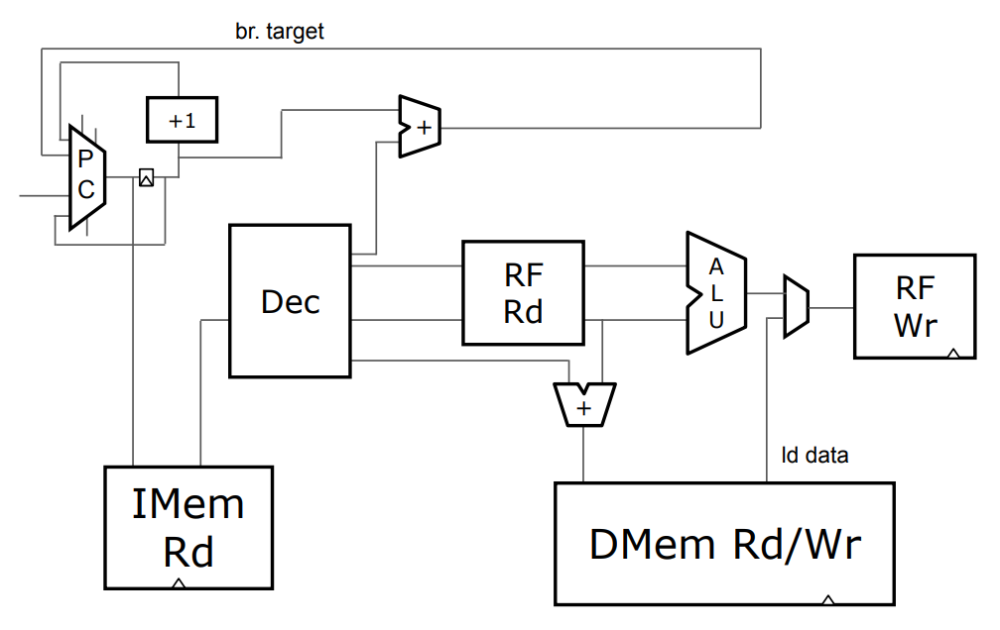
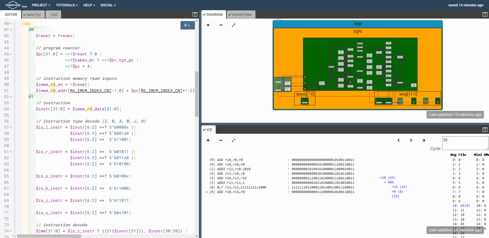
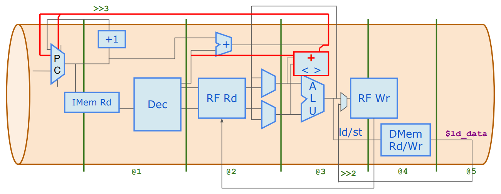
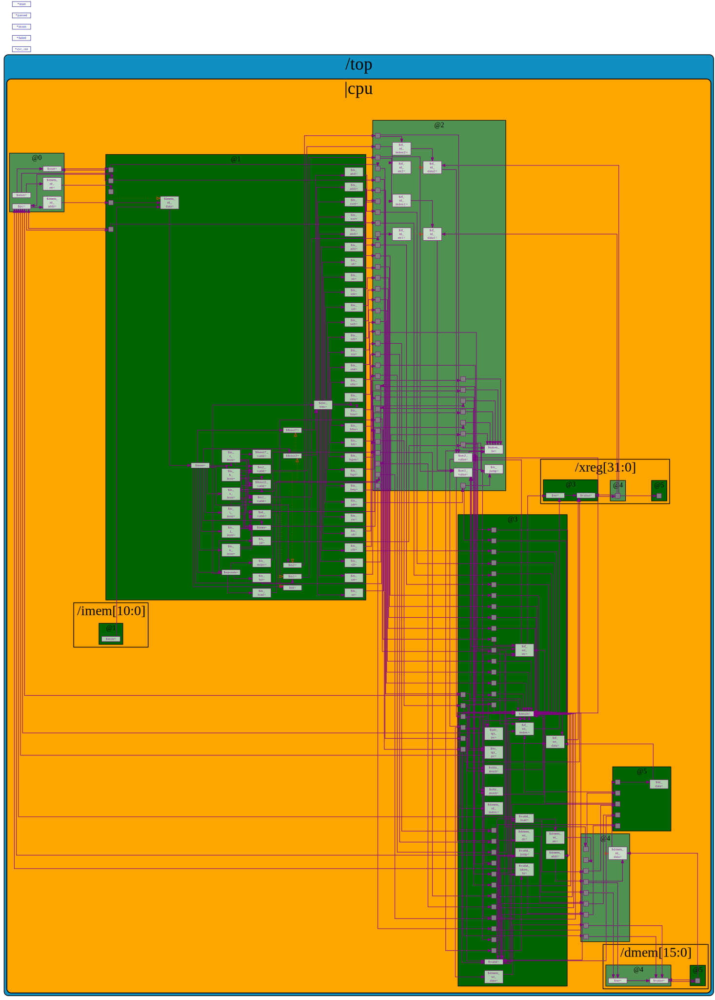
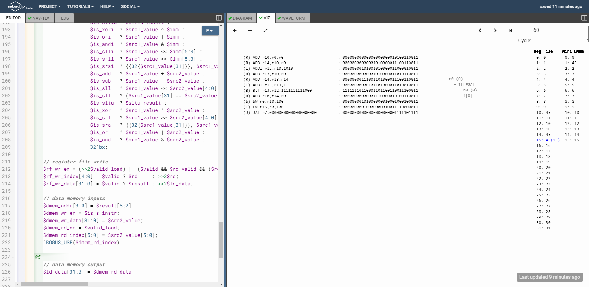
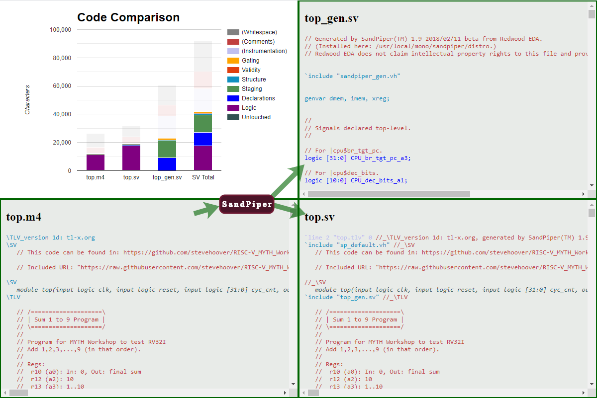

# Day 3-5 Content

| File | Description |
| ---- | ----------- |
| [calculator_solutions.tlv](calculator_solutions.tlv) | Calculator with single value memory for Day 3 lab |
| [risc-v_solutions.tlv](risc-v_solutions.tlv) | RISC-V core for Day 4-5 labs |

# Day 3

Day 3 consisted of learning TL-Verilog and many of its features to design the RISC-V core.

## Day 3 Lab: Calculator Single Value Memory Lab

A simple calculator with single value memory and validity was created; view source [here](calculator_solutions.tlv). The diagram and viz showing one cycle of operation:

# Day 4
## RISC-V Microarchitecture

The building blocks of a simple CPU are program counter (PC), instruction memory (IMem Rd), instruction decoder (Dec), register file read (RF Rd), arithmetic logic unit (ALU), register file write (RF Wr), and data memory (DMem Rd/Wr). The following diagram depicts the connections between these blocks:

## Day 4 Lab: Simple RISC-V Core

A simple RISC-V core from fetch and decode to control logic with branching was created; view source [here](risc-v_solutions.tlv). The diagram and viz showing final instruction executed:

# Day 5
## RISC-V Pipelining

Pipelining is used in designs to cut down the amount of combinational logic between flip-flops. This allows for higher clock speeds and, for a processor, more instructions per second (IPS). In order for this to function properly, the flow of logic must be broken up into pipe stages; the implemented RISC-V core's stages are seen in the below diagram:

This introduces hazards that were not seen before pipelining:
- Control flow hazard
    - **Hazard:** branch and jump instructions update PC in stage **@3** when it is needed in stage **@1**
    - **Solution:** invalidate the next 2 instructions
- Read after write hazard
    - **Hazard:** register file read occurs before register file write on previous instruction (stage **@4** versus **@2**)
    - **Solution:** for dependent instructions (write to register followed by read from same register), select previous instruction's ALU output data/register file write input data (write stage **@3** is in parallel with read stage **@2**)
- Load instruction redirect
    - **Hazard:** load data from memory is valid 2 cycles after register write (stage **@5** versus **@3**)
    - **Solution:** invalidate the next 2 instructions and select load data for register file write data when it is valid

## Day 5 Lab: Pipelined RISC-V Core

A RISC-V core that implements the ISA was pipelined; view source [here](risc-v_solutions.tlv).

### RISC-V Core Block Diagram

The pipe stages are the green boxes and contain signals for that stage.

### Viz of Final Result being Stored/Loaded

The final summation result of 45 was stored in DMem (address 1) then loaded from DMem into r15/a5.

### Resultant Verilog Comparison

SandPiper generated ~40,000 characters of SystemVerilog from ~10,000 characters of TL-Verilog (excluding whitespace, comments, and instrumentation).

# Future Work

The current state of this RISC-V core implements almost all of RV32I base instruction set. Future improvements include completing the remaining instructions in RV32I and adding instruction set extensions such as RV32M, RV32F, and RV32D.
