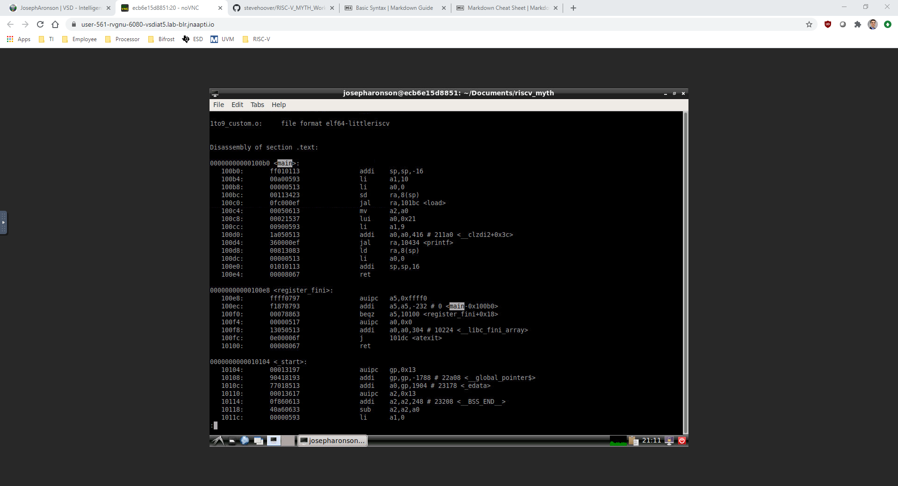
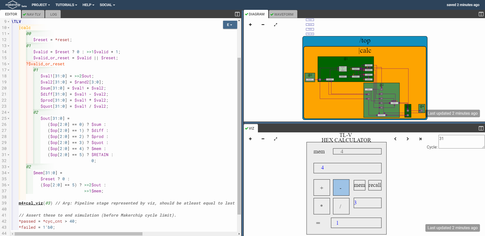
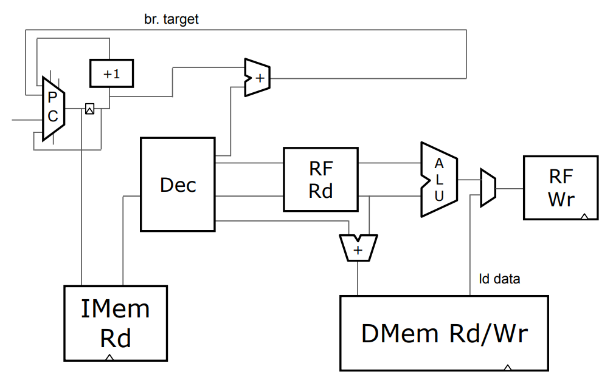
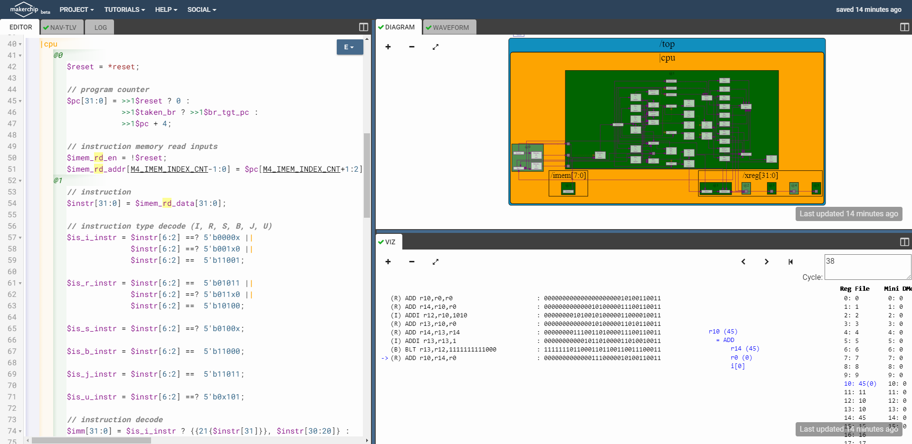
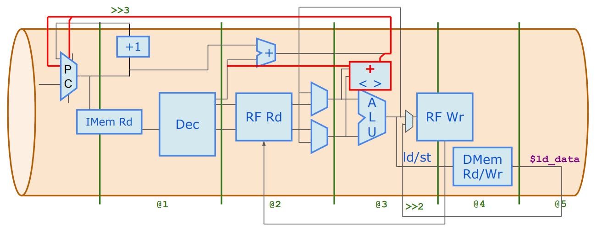
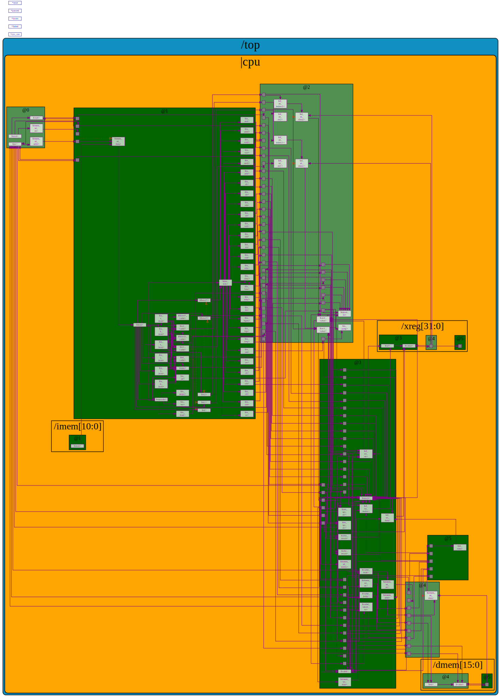
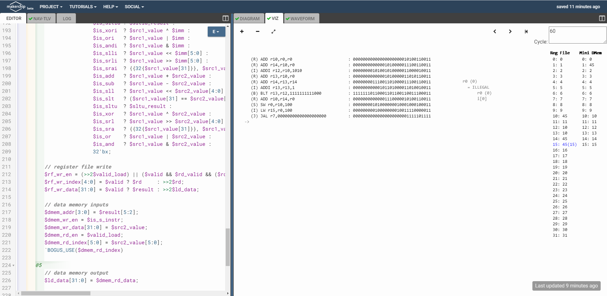
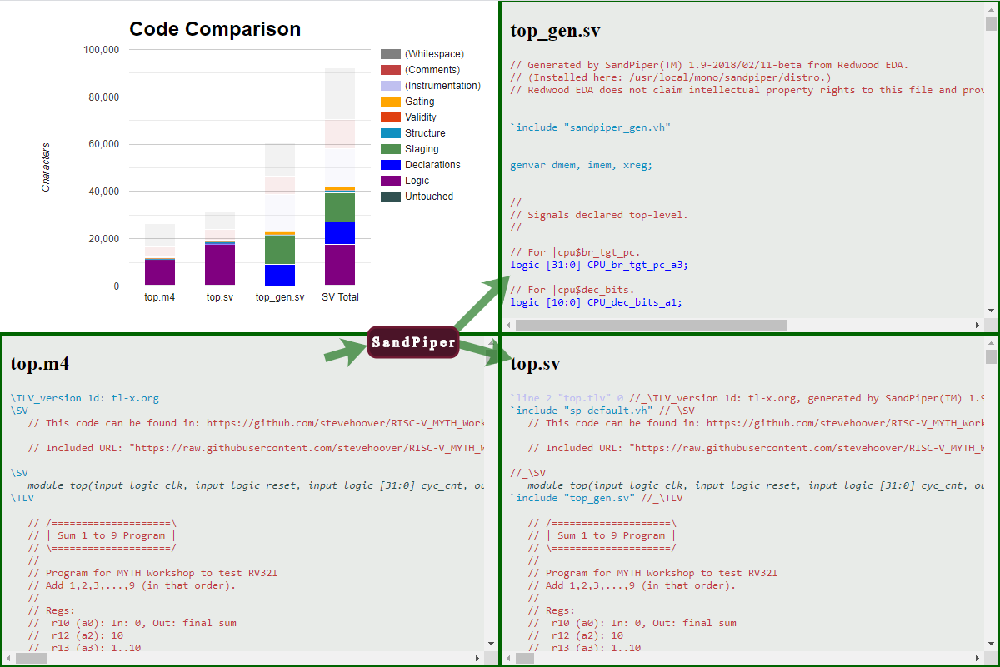

# RISC-V based Microprocessor using TL-Verilog

This repository contains information and code that was formed during the [RISC-V MYTH Workshop](https://github.com/stevehoover/RISC-V_MYTH_Workshop). A RISC-V pipelined core that supports RV32I base integer instructions was developed on [Makerchip](https://www.makerchip.com/) and written in [TL-Verilog](http://tl-x.org/).

# Table of Contents
- [Day 1](#day-1)
    - [Introduction to RISC-V ISA](#introduction-to-risc-v-isa)
    - [GNU Compiler Toolchain](#gnu-compiler-toolchain)
        - [RISC-V Toolchain](#risc-v-toolchain)
- [Day 2](#day-2)
    - [Application Binary Interface (ABI)](#application-binary-interface-abi)
    - [Day 2 Lab: ABI Function Calls](#day-2-lab-abi-function-calls)
- [Day 3](#day-3)
    - [TL-Verilog and Makerchip](#tl-verilog-and-makerchip)
    - [Day 3 Lab: Calculator Single Value Memory Lab](#day-3-lab-calculator-single-value-memory-lab)
- [Day 4](#day-4)
    - [RISC-V Microarchitecture](#risc-v-microarchitecture)
    - [Day 4 Lab: Simple RISC-V Core](#day-4-lab-simple-risc-v-core)
- [Day 5](#day-5)
    - [RISC-V Pipelining](#risc-v-pipelining)
    - [Day 5 Lab: Pipelined RISC-V Core](#day-5-lab-pipelined-risc-v-core)
- [Future Work](#future-work)
- [References](#references)
- [Acknowledgements](#acknowledgements)
- [Contact Information](#contact-information)

# Day 1
## Introduction to RISC-V ISA

RISC-V is an open standard instruction set architecture (ISA), meaning it is provided under open source licenses and available to the public. It is comprised of a base integer ISA (RV32I/RV64I) with optional extension ISAs and belongs to the little endian memory addressing system.

## GNU Compiler Toolchain

The GNU compiler toolchain is a collection of programming tools used for developing applications and operating systems; it has tools that make and compile code into machine-readable programs. The flow from user to machine code is as follows:
1. **Preprocessor:** process user code to be read by compiler such as macro expansion and file inclusion.
2. **Compiler:** compile source code to assembly instructions
3. **Assembler:** convert assembly to relocatable machine code
4. **Linker:** converts assembler output to absolute machine code

### RISC-V Toolchain

Compile command:

`$ riscv64-unkown-elf-gcc -O<1/fast> -mabi=lp<XLEN> -march=rv<XLEN>i -o <output_program> <input_user_file> [<input_user_file>...]`

Assembly preview command:

`$ riscv64-unkown-elf-objdump -d <output_program>`

Run command:

`$ spike pk <output_program>`

Debug command:

`$ spike -d pk <output_program>`

# Day 2
## Application Binary Interface (ABI)

The Application Binary Interface (ABI), also known as the System Call Interface, is used by the program to access the ISA registers. RISC-V architecture contains 32 registers of width 32/64 if using RV32I/RV64I, respectively:

| Register | ABI Name | Usage |
| -------- | -------- | ----- |
| x0 | zero | Hard-wired zero |
| x1 | ra | Return address |
| x2 | sp | Stack pointer |
| x3 | gp | Global pointer |
| x4 | tp | Thread opinter |
| x5-7 | t0-2 | Temporaries |
| x8 | s0/fp | Saved register/frame pointer |
| x9 | s1 | Saved register |
| x10-11 | a0-1 | Function arguments/return values |
| x12-17 | a2-7 | Function arguments |
| x18-27 | s2-11 | Saved registers |
| x28-31 | t3-6 | Temporaries |

There are 3 types of instructions:
1. **R-type:** operate only on registers 
    Ex: `add x8, x24, x8`
2. **I-type:** operate on registers and immediate values 
    Ex: `ld x8, 16(x23)`
3. **S-type:** operate on source registers and store in immediate value 
    Ex: `sd x8, 8(x23)`

## Day 2 Lab: ABI Function Calls

A simple program for summing numbers 1 to 9 was created; view source in [Day2](Day2) folder. The compiled output in assembly looks like this:

# Day 3
## TL-Verilog and Makerchip

Transaction-Level Verilog ([TL-Verilog](https://www.redwoodeda.com/tl-verilog)) is a hardware descriptive language (HDL) that extends Verilog in the context of pipelines; specifically, it maintains behavior of the circuit while being timing abstract, which means it takes care of retiming.

[Makerchip](https://www.makerchip.com/) is a free online platform made by [Redwood EDA](https://www.redwoodeda.com/). It supports TL-Verilog, SystemVerilog, and Verilog languages to code, compile, simulate, and debug digital designs.

## Day 3 Lab: Calculator Single Value Memory Lab

A simple calculator with single value memory and validity was created; view source [here](Day3_5/calculator_solutions.tlv). The diagram and viz showing one cycle of operation:

# Day 4
## RISC-V Microarchitecture

The building blocks of a simple CPU are program counter (PC), instruction memory (IMem Rd), instruction decoder (Dec), register file read (RF Rd), arithmetic logic unit (ALU), register file write (RF Wr), and data memory (DMem Rd/Wr). The following diagram depicts the connections between these blocks:

## Day 4 Lab: Simple RISC-V Core

A simple RISC-V core from fetch and decode to control logic with branching was created; view source [here](Day3_5/risc-v_solutions.tlv). The diagram and viz showing final instruction executed:

# Day 5
## RISC-V Pipelining

Pipelining is used in designs to cut down the amount of combinational logic between flip-flops. This allows for higher clock speeds and, for a processor, more instructions per second (IPS). In order for this to function properly, the flow of logic must be broken up into pipe stages; the implemented RISC-V core's stages are seen in the below diagram:

This introduces hazards that were not seen before pipelining:
- Control flow hazard
    - **Hazard:** branch and jump instructions update PC in stage **@3** when it is needed in stage **@1**
    - **Solution:** invalidate the next 2 instructions
- Read after write hazard
    - **Hazard:** register file read occurs before register file write on previous instruction (stage **@4** versus **@2**)
    - **Solution:** for dependent instructions (write to register followed by read from same register), select previous instruction's ALU output data/register file write input data (write stage **@3** is in parallel with read stage **@2**)
- Load instruction redirect
    - **Hazard:** load data from memory is valid 2 cycles after register write (stage **@5** versus **@3**)
    - **Solution:** invalidate the next 2 instructions and select load data for register file write data when it is valid

## Day 5 Lab: Pipelined RISC-V Core

A RISC-V core that implements the ISA was pipelined; view source [here](Day3_5/risc-v_solutions.tlv).

### RISC-V Core Block Diagram

The pipe stages are the green boxes and contain signals for that stage.

### Viz of Final Result being Stored/Loaded

The final summation result of 45 was stored in DMem (address 1) then loaded from DMem into r15/a5.

### Resultant Verilog Comparison

SandPiper generated ~40,000 characters of SystemVerilog from ~10,000 characters of TL-Verilog (excluding whitespace, comments, and instrumentation).

# Future Work

The current state of this RISC-V core implements almost all of RV32I base instruction set. Future improvements include completing the remaining instructions in RV32I and adding instruction set extensions such as RV32M, RV32F, and RV32D.

# References

A compiled list of references used during this workshop:
- **RISC-V International:** https://riscv.org
- **TL-Verilog:** https://www.redwoodeda.com/tl-verilog and http://tl-x.org
- **Makerchip:** https://www.makerchip.com
- **Redwood EDA:** https://www.redwoodeda.com
- **VLSI System Design:** https://www.vlsisystemdesign.com

# Acknowledgements

- **[Kunal Ghosh](https://github.com/kunalg123)**, Co-founder, VSD Corp. Pvt. Ltd.
- **[Steve Hoover](https://github.com/stevehoover)**, Founder, Redwood EDA

# Contact Information
- **[Joseph Aronson](https://www.linkedin.com/in/aronsonjoseph)**, Design Engineer, Texas Instruments Inc.
    - **Email:** [jaronson@ti.com](mailto:jaronson@ti.com)
